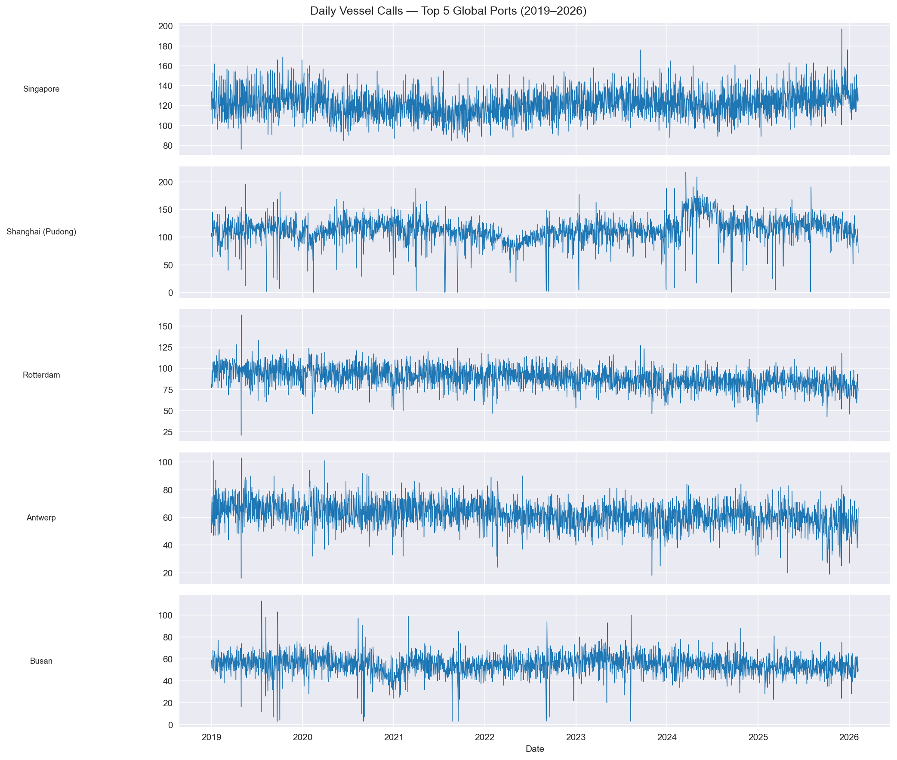
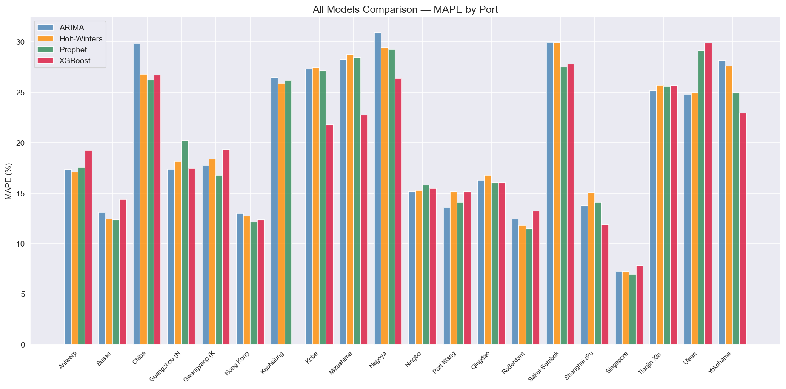
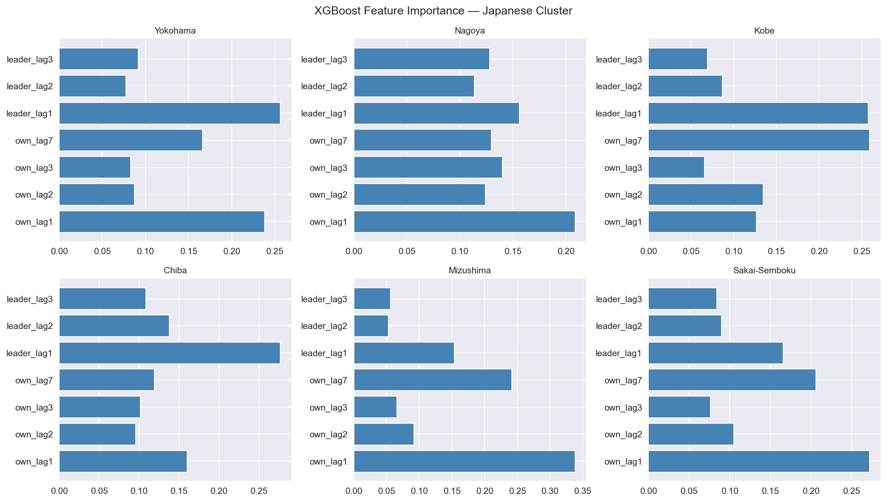

# Supply Chain Contagion: Does Port Disruption Spread?

Most port-monitoring dashboards track one port at a time. This project asks a
different question: **when one port is disrupted, does the disruption spread
to other ports — and if so, how fast and how far?**

## Data

- **Port activity**: daily vessel call counts (`portcalls`) for global ports,
  2019–2026.
- **Disruption events**: labeled real-world events (COVID-19 lockdowns, Suez
  Canal blockage, Red Sea crisis) with severity levels, used to cross-reference the
  disruption signal against known ground truth.
- Analysis is restricted to the top 20 ports by total vessel-call volume.



## Method

**1. Defining disruption.**
A port is flagged as having a *Port Disruption Event (PDE)* on any day its
vessel calls fall more than 1.5 standard deviations below its own trailing
30-day rolling mean. This turns a noisy count series into a binary signal
that can be compared across ports.

**2. Classical forecasting baseline.**
ADF stationarity testing, ACF/PACF-guided and auto-selected ARIMA, and
Holt-Winters exponential smoothing, benchmarked per port. Classical models
forecast stable hubs (Singapore, Rotterdam) well but produce flat, uninformative
forecasts for volatile ports (Nagoya, Shanghai) — they can't anticipate
external shocks.

**3. Cross-port correlation.**
Pairwise, lagged correlation between every port's PDE series, to test whether
disruption at one port predicts disruption at another shortly after.

**4. Advanced models.**
- **VAR** on two port clusters (Japanese ports; Ningbo–Shanghai) to jointly
  model co-movement.
- **Granger causality** to test directional predictive relationships between
  specific port pairs.
- **Prophet** with known disruption events (COVID, Suez, Red Sea) added as
  explicit regressors.
- **XGBoost** using each port's own lag features plus its statistically
  strongest "leading" port's lags, with feature importance to interpret which
  lags actually drive predictions.

## Results

XGBoost outperforms classical models specifically for the Japanese port
cluster (Kobe, Mizushima, Nagoya, Yokohama, Shanghai) — exactly where
leader-lag features were available. Elsewhere, classical models (ARIMA,
Holt-Winters, Prophet) remain competitive or better. In other words:
added model complexity only helped where there was a specific, motivated
signal to exploit — it didn't help uniformly, and the results say so.





The importance plots show why: `own_lag1` and `leader_lag1` dominate for
every port in this cluster, meaning the model is genuinely leaning on the
lag structure, not treating features arbitrarily.

Full per-port comparison: `outputs/processed/final_comparison.csv`.

## Known limitations

Being upfront about the current state, not just the results:

- **Multiple comparisons are not yet corrected.** The cross-port correlation
  step runs ~5,300 pairwise hypothesis tests (20 ports × 19 possible leaders ×
  14 lags) at an uncorrected α = 0.05. At that scale, roughly 250–270
  "significant" pairs would be expected from noise alone, even with zero true
  contagion in the data. The reported "leader" relationships (and therefore
  the XGBoost leader-lag features and the regional-contagion narrative) should
  be treated as a hypothesis, not a confirmed finding, until a Bonferroni or
  FDR correction is applied. This is the top item in progress.
- The EDA notebook currently has a step that isn't self-contained (a variable
  used later isn't defined earlier in the same notebook), so it doesn't yet
  run cleanly top-to-bottom from a fresh kernel. Being fixed.
- Weather/exogenous data aside from the three labeled disruption events isn't
  used; the model relies on vessel-call history and event flags only.

## Tech stack

Python · pandas · NumPy · statsmodels (ADF, ARIMA, VAR, Granger causality,
seasonal decomposition) · pmdarima (auto-ARIMA) · Prophet · XGBoost ·
scikit-learn (metrics) · matplotlib · seaborn

## Repo structure

```
notebooks/
├── 01_eda.ipynb                # PDE definition, event validation, correlation
├── 02_classical_models.ipynb   # ADF, ARIMA, Holt-Winters, cross-correlation
└── 03_advanced_models.ipynb    # VAR, Granger causality, Prophet, XGBoost

outputs/
├── figures/                    # all saved plots
└── processed/                  # intermediate CSVs (PDE flags, model results)
```

## How to run

```bash
pip install -r requirements.txt
jupyter notebook notebooks/01_eda.ipynb   # run in order: 01 → 02 → 03
```